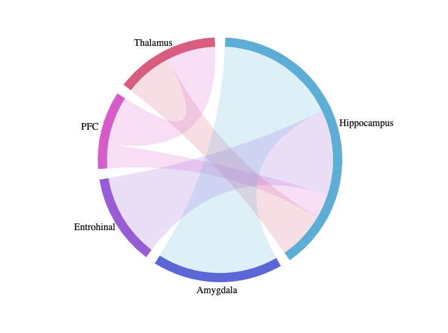

# chordPlot

Visualize chord plots directly in the browser. 

Simply paste your graph data into the text area and hit "Plot it"

Make sure your data is formatted as: <i> from,to,value; from,to,value; ... <i> 

Give it a try

<a href="https://www.diogosantospata.com/chordPlot/" target="_blank">chordPlot</a>

